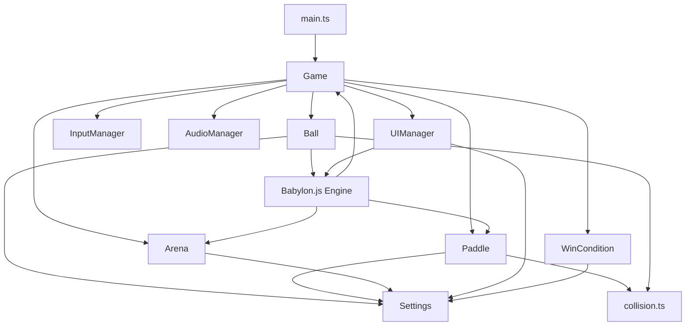
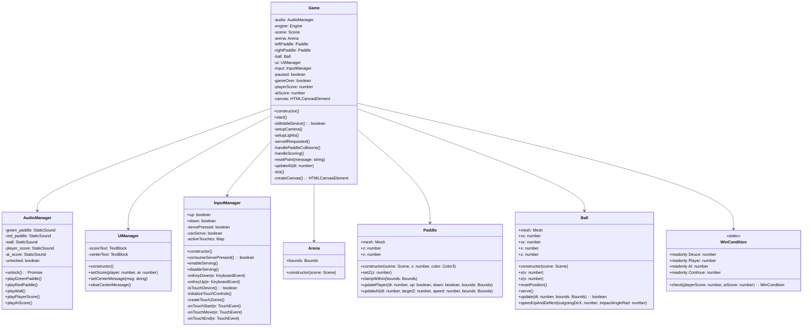
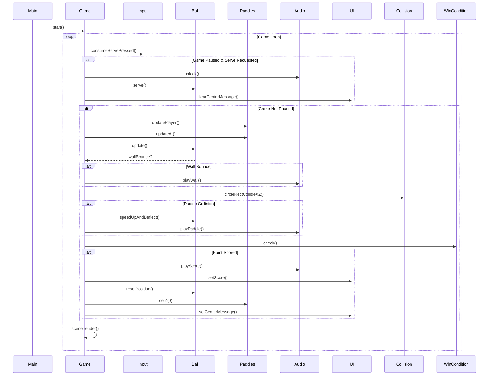
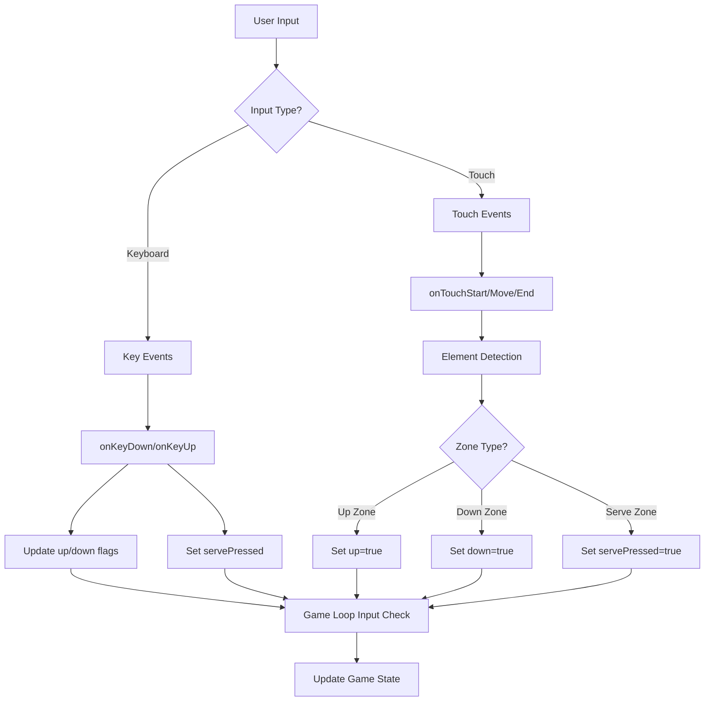
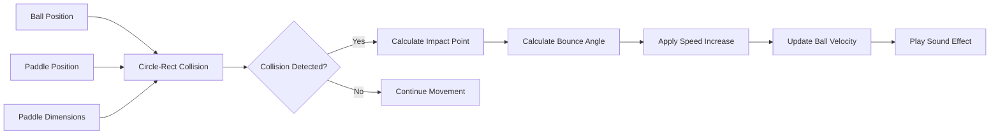
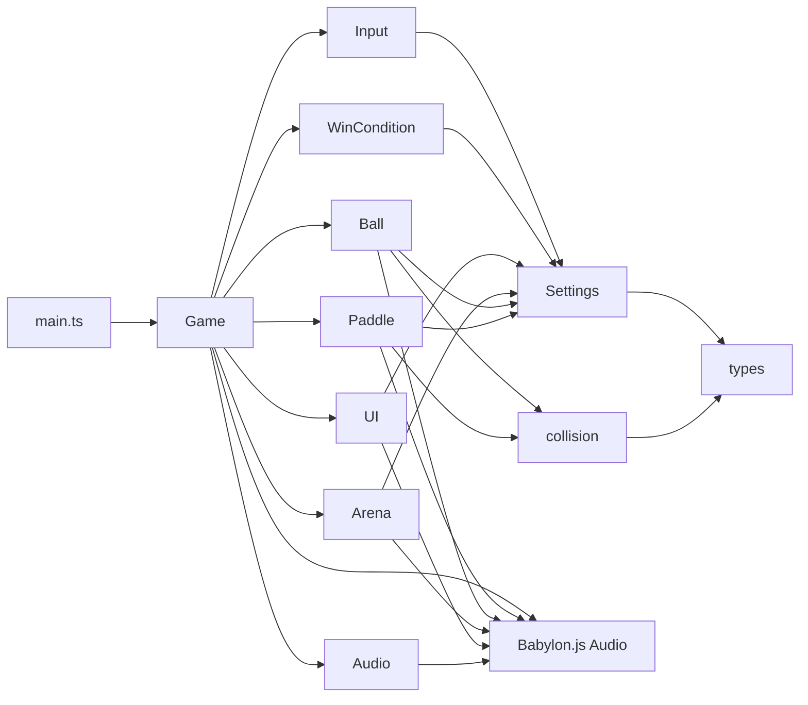
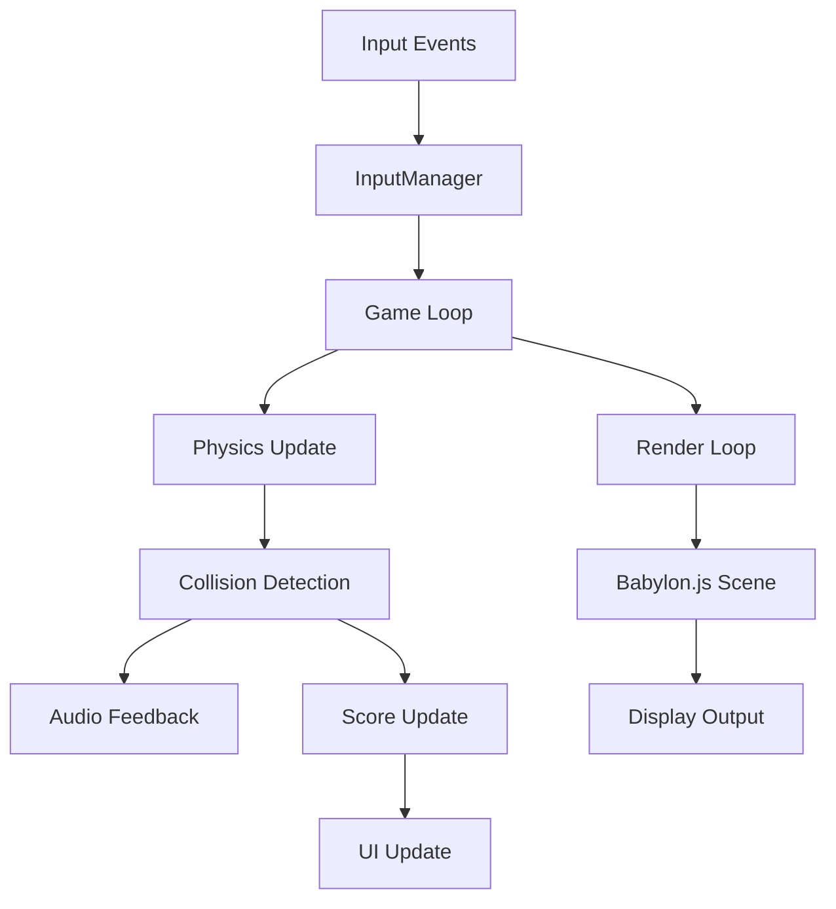
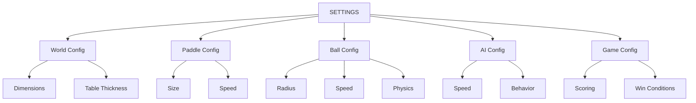

# Pong Game Architecture

## Overview

The Pong game is built using Babylon.js for 3D rendering, TypeScript for type-safe development, and Vite for build tooling. The architecture follows a modular design with clear separation of concerns between game logic, rendering, input handling, and audio management.

## System Architecture

## Class Diagram

## Game Loop Sequence Diagram

## Input Handling Flow

## Collision Detection System

## Module Dependencies

## Data Flow

## Key Design Patterns

### 1. **Singleton Pattern**
- `Game` class manages the entire game state
- `Settings` provides global configuration

### 2. **Observer Pattern**
- Babylon.js scene uses observables for render loop
- Input events are handled through event listeners

### 3. **Factory Pattern**
- Mesh creation through Babylon.js `MeshBuilder`
- Material creation for visual elements

### 4. **Strategy Pattern**
- Different input strategies (keyboard vs touch)
- AI behavior vs player control

## Configuration Management

The `Settings` module provides centralized configuration:

## Performance Considerations

1. **Render Loop Optimization**: Single render loop with efficient state updates
2. **Collision Detection**: Optimized circle-rectangle collision algorithm
3. **Audio Management**: Lazy loading and proper unlocking for browser compliance
4. **Memory Management**: Proper cleanup and object reuse

## Extensibility

The architecture supports easy extension:

- **New Game Modes**: Extend `WinCondition` class
- **Additional Input**: Implement new input handlers in `InputManager`
- **Visual Themes**: Modify material creation in `Arena` and `Paddle`
- **AI Behaviors**: Enhance `updateAI` method in `Paddle` class
