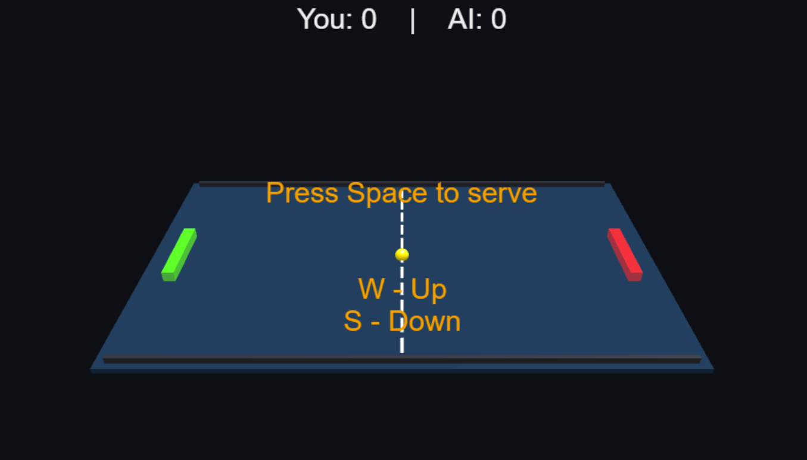

# Pong

An example of a 3D Pong game written with Babylon.JS, TypeScript, and Vite

## Table of Contents

- [Pong](#pong)
  - [Table of Contents](#table-of-contents)
  - [How to Play](#how-to-play)
    - [Controls](#controls)
  - [TODO](#todo)
  - [Credits](#credits)
    - [Sounds](#sounds)

## How to Play

It is the classic game of Ping Pong.  Move your paddle to knock the ball back to the other side.  If your opponent misses, you get a point.

Visit [pong](https://corysia.github.io/pong) to start the game.

### Controls

- W - Move paddle up
- S - Move paddle down
- Spacebar - start the game

- Green Paddle - Player's Paddle
- Red Paddle - AI's paddle

You may pan around the game board with the mouse.

- Left Mouse button - rotate
- Right mouse button - change position
- Middle mouse wheel - zoom in and out

## TODO

- Add music
- Add win conditions
  - Scoring:
    - A point is awarded to the opponent if a player fails to make a legal serve, return, or otherwise violates the rules.
    - Games are played to 11 points.
    - To win a game, a player must be the first to reach 11 points with a two-point lead.
    - If the score reaches 10-10 (deuce), the game continues until one player gains a two-point lead.
    - Matches are typically the best of three or five games (or best of five or seven in tournaments).

## Credits

- [Babylon.JS](https://www.babylonjs.com/)
- [TypeScript](https://www.typescriptlang.org/)
- [Vite](https://vitejs.dev/)

### Sounds

- [Audio by thirteenthfail](https://freesound.org/people/thirteenthfail/)
