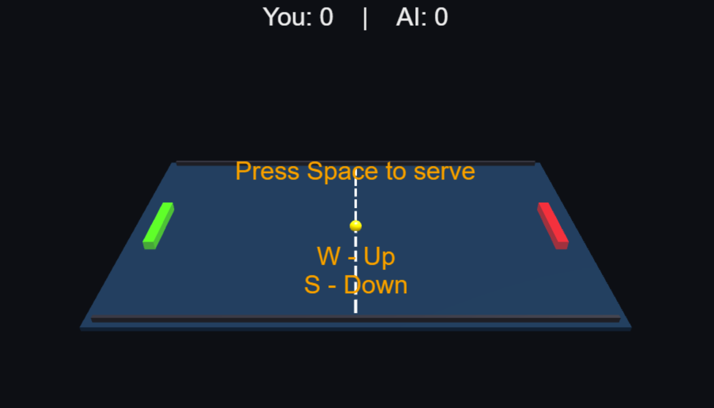

# Pong

An example of a 3D Pong game written with Babylon.JS, TypeScript, and Vite

## Table of Contents

- [Pong](#pong)
  - [Table of Contents](#table-of-contents)
  - [Architecture Documentation](#architecture-documentation)
  - [How to Play](#how-to-play)
    - [Scoring](#scoring)
    - [Controls](#controls)
      - [Paddles](#paddles)
      - [Camera](#camera)
  - [Credits](#credits)
    - [Sounds](#sounds)

## Architecture Documentation

For detailed architecture documentation, class diagrams, and system design, see [DESIGN.md](./DESIGN.md).

## How to Play

It is the classic game of Pong.  Move your paddle to knock the ball back to the other side.  If your opponent misses, you get a point.

Visit [pong](https://corysia.github.io/pong) to start the game.

### Scoring

- Games are played to 11 points.
- To win a game, a player must be the first to reach 11 points with a two-point lead.
- If the score reaches 10-10 (deuce), the game continues until one player gains a two-point lead.
- If one player scores 6 points and the other player's score is still 0, the game ends.
  
### Controls

#### Paddles

`Green Paddle` - Player's Paddle

`Red Paddle` - AI's paddle

**Desktop Controls:**

- W - Move paddle up
- S - Move paddle down
- Spacebar - start the game

**Mobile Controls:**

- **Left Side - Top Half** (Green Zone): Move paddle up
- **Left Side - Bottom Half** (Red Zone): Move paddle down  
- **Right Side** (Any Area): Tap to serve

The game automatically detects mobile devices and displays touch controls with visual indicators.

#### Camera

You may pan around the game board with the mouse.

- Left Mouse button - rotate
- Right mouse button - change position
- Middle mouse wheel - zoom in and out

## Credits

- [Babylon.JS](https://www.babylonjs.com/)
- [TypeScript](https://www.typescriptlang.org/)
- [Vite](https://vitejs.dev/)

### Sounds

- [Audio by thirteenthfail](https://freesound.org/people/thirteenthfail/)
